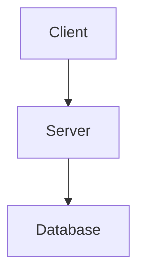

# Preview — Visual Explanations

Generate ASCII diagrams, Mermaid charts, and visual explanations for code and architecture.

## Usage

```
/sl:preview --explain <topic>    # ASCII + Mermaid + prose
/sl:preview --diagram <topic>    # Architecture/data flow (Mermaid)
/sl:preview --ascii <topic>      # Terminal-friendly ASCII only
```

No args or no mode: use `AskUserQuestion` with mode options.

## Modes

| Mode | Output | Browser Required |
|------|--------|-----------------|
| `--explain` | ASCII art + Mermaid diagram + prose explanation | Optional |
| `--diagram` | Mermaid diagram (architecture, data flow, sequence) | Yes (for render) |
| `--ascii` | Terminal-friendly ASCII art only | No |

## Workflow

### Step 1 — Parse Input

Extract:
- **Mode** — explain, diagram, or ascii
- **Topic** — what to visualize

If topic references codebase concepts, run quick `Grep` / `Glob` to understand actual structure.

### Step 2 — Scout (if needed)

If topic references code patterns or architecture:
- Read relevant source files
- Use `sl ast search` for structural patterns
- Use `sl lsp references` for dependency mapping

### Step 3 — Generate Visual

**ASCII mode:**
```
┌──────────┐     ┌──────────┐
│  Client   │────▶│  Server  │
└──────────┘     └─────┬────┘
                       │
                 ┌─────▼────┐
                 │ Database  │
                 └──────────┘
```

**Diagram mode (Mermaid v11):**


**Explain mode:** Combine ASCII + Mermaid + prose walkthrough.

### Step 4 — Save Output

Save to:
- If plan active: `{plan-dir}/visuals/{slug}.md`
- If no plan: `plans/visuals/{slug}.md`

Slug: lowercase topic, replace spaces with hyphens, max 80 chars.

### Step 5 — Display

Output inline for terminal display. For Mermaid diagrams, also save the `.md` file for browser rendering.

## Constraints

- ASCII mode must work without browser — pure terminal output
- Mermaid syntax must be v11 compatible
- Generation-only for v1 (no file/directory viewing mode)
- Keep diagrams focused — max 15-20 nodes for readability
- Use `sl ast search` and `sl lsp references` for accurate code structure visualization
